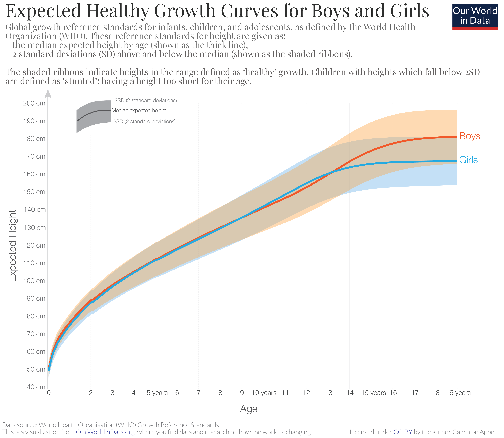

```{r setup, include=FALSE}
knitr::opts_chunk$set(echo = FALSE)
```


```{r, message=FALSE, cache=TRUE}
library("cmdstanr")
library("rstan")
library("ggplot2")
library("reshape2")
library("tidyverse")
library("kableExtra")
library("posterior")
library("scales")
```

```{r, cache=TRUE}
summy <- function(x, alpha = 0.95){
  nn <- colnames(x)
  mm <- colMeans(x)
  mn <- apply(x, 2, median)
  ll <- apply(x, 2, quantile, probs = (1 - alpha)/2)
  uu <- apply(x, 2, quantile, probs = (1 + alpha)/2) 
  out <- data.frame(variable = nn, 
                    Mean =  mm,
                    Median = mn,
                    Lower = ll,
                    Upper = uu)
  return(out)
}
```


# Background

In this report we will employ Bayesian statistical methods to address a few questions about the so-called "manner verbs".
We will analyse data from six languages: Spanish, Italian, French, German, Brazilian Portuguese (BP) and English.
The goal is to understand differences between languages in the proportion and rate of occurrence of manner verbs, as well as understand within-language (i.e. between-speakers) variation when disaggregated data per speaker is available.
Specifically, the experimental design consists of eliciting oral narratives (raw data) based on a wordless picture book - Frog, where are you? [@Mayer1969].
This children’s book presents a total of 24 scenes that indicate a sequence of events in which the main characters, a boy and his dog, engage in search of an escaped frog.
We used the clause as our unit of analysis and identified the motion events’ path and manner components, following Talmy's description [@Talmy1991].

First, we will show the data under analysis and then we will fit a few statistical models using [Stan](https://mc-stan.org/).

# Part I: The data

Part of the data analysed here is from @Hijazo2013 ("Tabla I" therein).
The disaggregated data on Brazilian Portuguese ($N_1 = 14$ speakers) and English ($N_2 = 12$ speakers) were collected in the present study.

```{r, cache=TRUE}
portuguese.manner.data <- data.frame(
  speaker = paste0("2018-", 1:14),
  total_types = c(23, 20, 11, 10, 10,
                  12, 9, 13, 13, 12,
                  18, 13, 14, 20),
  types_manner = c(2, 1, 1, 2, 1,
                   1, 1, 2, 1, 2,
                   1, 1, 1, 1),
  occurrences_manner = c(3, 4, 1, 3, 1,
                         1, 1, 4, 1, 3,
                         1, 2, 2, 4)
)

english.manner.data <- data.frame(
  speaker = c("20-a", "20-b", "20-c", "20-d",
              "20-e", "20-f", "20-g", "20-h",
              "20-i", "20-j", "20-k", "20-l"
  ),
  total_types = c(14, 17, 28, 13,
                  18, 21, 18, 22,
                  15, 15, 19, 18),
  types_manner = c(2, 3, 6, 4,
                   6, 4, 2, 3,
                   2, 6, 4, 2),
  occurrences_manner = c(2, 5, 10, 7,
                         8, 6, 3, 6,
                         3, 8, 4, 2)
)

tableI <- data.frame(
  language = c("Spanish", "Italian", "French", "German",
               "BP", "English"),
  total_types = c(39, 60, 53, 67,
                  21, 41),
  types_manner = c(7, 10, 3, 23,
                   5, 20),
  nspeakers = c(12, 12, 12, 12,
                nrow(portuguese.manner.data),
                nrow(english.manner.data)),
  occurrence_manner = c(11, 16, 14, 62,
                        sum(portuguese.manner.data$occurrences_manner),
                        sum(english.manner.data$occurrences_manner))
)
table_I <- rename(tableI,
                  'Language' = language,
                  'Total types' = total_types,
                  'Manner types' = types_manner,
                  'No. speakers'= nspeakers,
                  'Occurrences (manner)' = occurrence_manner)
```

Let us first look at the aggregated data, which contains: the total types of 'movement verbs', number of types of manner verbs,  the number of speakers measured for each language and the number of occurrences of manner verbs in the texts analysed.
Table \@ref(tab:tabdata) contains the aggregated data we will analyse.

Figure \@ref(fig:figdata) helps to visualise the disaggregated (per speaker) data.
Notice there is substantial variability between speakers in their use of movement verbs in general and manner verbs in particular.
A proper statistical treatment will take that variability into account when assessing between-language differences.

```{r tabdata, echo = FALSE, results='markup', cache=TRUE}
knitr::kable(table_I, booktabs = TRUE, caption = "Aggregated on manner verb usage in six languages." ) %>%  kable_styling(position = "center")
```

```{r figdata,  echo=FALSE, results='asis', fig.align = 'center', fig.cap = "Boxplots of disaggregated counts for total types of movement verbs, types manner verbs and occurrences of manner verbs.", cache=TRUE}
disagg.data <- data.frame(
  Language = c(rep("Portuguese", 14), rep("English", 12)),
  Total = c(portuguese.manner.data$total_types, english.manner.data$total_types),
  Types = c(portuguese.manner.data$types_manner, english.manner.data$types_manner),
  Occurrences = c(portuguese.manner.data$occurrences_manner, english.manner.data$occurrences_manner)
)
suppressMessages(
  disagg.forPlot <- melt(disagg.data,
                         variable.name = "Variable",
                         value.name = "count")
)

fig0 <- ggplot(data = disagg.forPlot,
               aes(x = Language, y = count,
                   colour = Language, fill = Language)) +
  geom_boxplot(alpha = .4) + 
  geom_jitter(colour = "black", size = 0.4, alpha = 0.9) +
  scale_y_continuous("Counts",
                     breaks = trans_breaks(identity, identity, n = 4),
                     expand = c(0, 0)) + 
  facet_grid(.~Variable, scales = "free_y") +
  theme_bw(base_size = 16) + 
  theme(axis.title.x = element_blank(),
        axis.text.x = element_blank(),
        axis.ticks.x = element_blank())
fig0
```


# Part II: analysis of aggregated data

We will start by analysing the counts aggregated by language and thus ignore within-language variation for now.

## Question 1: Do languages differ with respect to the proportion of manner verbs? 

The first question we shall tackle is whether language differ in the proportion of motion (movement) verbs that are also manner verbs.
To accomplish this, let us first fix some notation: let $n_i$ denote the number of (total) movement verbs observed in language $i$ and let $x_i$ be the number of these verbs that are manner verbs.
Statistically, we are thus interested in estimating the proportion, $p_i$, of movement verbs that are manner verbs for language $i$.
A reasonable statistical model for this problem is the binomial distribution:
$$
\begin{aligned}
x_i &\sim \operatorname{Binomial}(n_i, p_i);\\
p_i &= \frac{1}{1 + \exp(-[\theta + \delta_i])};\\
\theta &\sim \operatorname{Normal(0, 5)};\\
\delta_i &\sim \operatorname{Normal(0, 1)}.
\end{aligned}
$$
where we parametrise the normal distribution in terms of mean and standard deviation.
Let us break down the model: the proportion $p_i$ is modelled as having two components: an overall effect, $\theta$, which captures the overall proportion of manner verbs across all languages and a per-language effect, $\delta_i$, which reflects the modification each language makes to the "grand mean" represented by $\theta$.
This is what is commonly called in the statistical literature a "random effects" model.
Other names, which mean the same thing, are "hierarchical model" and "multilevel model".
The transformation $1/(1 + \exp(-x))$ serves the purpose of mapping $\theta$ and $\delta_i$ to the space of probabilities, $(0, 1)$, and is called the _inverse logit_ function.

Now that we have a model, let us fit it to the aggregated data and look at the results.
We will use Stan, via [cmdstanr](https://mc-stan.org/cmdstanr/) to fit this model using four chains of 1000 iterations (500 warmup, 500 sampling) each.
Details on the computing environment are given at the end of this document.
We report the posterior mean and 95\% Bayesian credible intervals (BCI) for the estimates of $p_i$ for each language.
```{r, warning=FALSE, message=FALSE, error=FALSE}
data.proportions <- list(
  K = nrow(tableI),
  N = tableI$total_types,
  y = tableI$types_manner
)

prop_model <- cmdstanr::cmdstan_model("stan/proportions.stan")

output <- capture.output(
  fit.proportions <- 
    prop_model$sample(data = data.proportions, refresh = 0, chains = 4,
                      parallel_chains = 4, show_messages = FALSE) 
) 

# fit.proportions
p.samples <- fit.proportions$draws("p", format = "df")
variables(p.samples) <- tableI$language
p.samples <- p.samples %>% select(tableI$language)
```

```{r proptab, echo = FALSE, results='markup', cache=TRUE}
raw.res.prop <- summy(p.samples)
rownames(raw.res.prop) <- NULL
results.prop <- rename(raw.res.prop, Language = variable)
knitr::kable(results.prop, digits = 2, booktabs = TRUE, caption = "Posterior mean and 95\\% BCIs for the proportion of manner verbs.") %>%  kable_styling(position = "center")
```
The results from fitting the Bayesian model discussed above are shown in Table \@ref(tab:proptab) and clearly indicate that Spanish and Italian have very similar proportions of manner verbs, while French and  Brazilian Portuguese (BP) show remarkably lower proportions.
Moreover, as expected by theory, German and English show similar proportions;  while around 1/3 of all movement verbs are manner verbs for German, in English this proportion is a bit higher.
These results can also be visualised in Figure \@ref(fig:propfig), which shows the breadth of the uncertainty around $p$ for each language.
The figure allows us to visualise patterns that might be hard to spot in the table.
For instance, it becomes immediately apparent that while German and English have similarly higher proportions of manner verbs, the uncertainty for German is bigger.

```{r propfig, echo=FALSE, results='asis', fig.align = 'center',  fig.cap = "Posterior density of the proportion of manner verbs for each language."}
suppressMessages(
  p.for.figure <- melt(p.samples, variable.name = "Language", value.name = "p") 
)

fig1 <- ggplot(data = p.for.figure, aes(x = p, colour = Language, fill = Language)) +
  geom_density(alpha = .4) +
  scale_x_continuous("Proportion of manner verbs", expand = c(0, 0)) +
  scale_y_continuous("Probability density", expand = c(0, 0)) +
  theme_bw(base_size = 16)

fig1
```


## Question 2: Do languages differ with respect to the average rate of manner verbs?

Having approached the question of the proportion of all movement verbs which are manner verbs, we now turn to the question of whether languages differ with respect to the *rate* of occurrence of manner verbs.
To model this problem, we will use a Poisson distribution for the numbers of occurrences.
We also account for the fact that different languages have different numbers of speakers by using the $n_i$ as an _offset_  and thus estimate a _per speaker_ rate.
Let $y_i$ be the total number of times a manner verb was mentioned across all speakers.
We are then interested in the rate $\lambda_i$ of occurrence of manner verbs in language $i$.
This setup leads to a model that reads:
$$
\begin{aligned}
y_i &\sim \operatorname{Poisson}(n_i\lambda_i);\\
\lambda_i &= \exp(\alpha + \eta_i);\\
\alpha &\sim \operatorname{Normal(0, 5)};\\
\eta_i &\sim \operatorname{Normal(0, 1)}.
\end{aligned}
$$
This model is similar in spirit to the one in the previous section; we have an overall (log) rate, $\alpha$, and language-specific effect $\eta_i$.
Results of fitting this model are shown in Table \@ref(tab:occtab) and Figure \@ref(fig:occfig).
As expected from theory, German and English show the highest rates, while the romance languages have lower rates, albeit with substantial variation between them.
Brazilian Portuguese and Italian show the highest rates, Spanish shows a lower rate.
French shows a rate compatible with Italian, with more uncertainty (wider BCIs).

```{r, warning=FALSE, message=FALSE, error=FALSE}
data.occurrence <- list(
  K = nrow(tableI),
  P = tableI$nspeakers,
  x = tableI$occurrence_manner
)

occurrence_model <- cmdstanr::cmdstan_model("stan/occurrence.stan")

out2 <- capture.output(
  fit.occurrence <- 
    occurrence_model$sample(data = data.occurrence,
                            refresh = 0,
                            chains = 4,
                            parallel_chains = 4,
                            show_messages = FALSE)
)

lambda.samples <- fit.occurrence$draws("lambda", format = "df")
variables(lambda.samples) <- tableI$language
lambda.samples <- lambda.samples %>% select(tableI$language)
```

```{r occtab,  echo = FALSE, results='markup', cache=TRUE}
raw.res.occurrence <- summy(lambda.samples)
rownames(raw.res.occurrence) <- NULL
results.occurrence <- rename(raw.res.occurrence, Language = variable)
knitr::kable(results.occurrence, digits = 2, booktabs = TRUE,
             caption = "Posterior mean and 95\\% BCIs for the rate of occurrence of manner verbs estimated from aggregated data.") %>%  kable_styling(position = "center")
```

```{r occfig,  echo=FALSE, results='asis', fig.align = 'center', fig.cap = "Posterior density for the rate of occurence of manner verbs estimated from aggregated data.", cache=TRUE}
suppressMessages(
  lambda.for.figure <- melt(lambda.samples,
                            variable.name = "Language",
                            value.name = "lambda")
)

fig2 <- ggplot(data = lambda.for.figure,
               aes(x = lambda, colour = Language, fill = Language)) +
  geom_density(alpha = .4) +
  scale_x_continuous("Mean rate of occurrence of manner verbs", expand = c(0, 0)) +
  scale_y_continuous("Probability density", expand = c(0, 0)) +
  theme_bw(base_size = 16)
fig2
```
# Part III: including disaggregated (by speaker) data

As show in Part I, we have disaggregated data per speaker for Brazilian Portuguese and English, and would like to take inter-speaker (i.e. within language) variation into account in our analysis.
This is important because performing inference on aggregated counts underestimates the heterogeneity between speakers and thus exaggerates differences between languages.
In this section we analyse all of the available data: language-level (aggregated counts) for Spanish, Italian, French and German and speaker-level counts for Brazilian Portuguese and English.

## Question 3: Do languages differ with respect to the mean rate of occurrence of manner verbs taking inter-speaker variation into account?

We will modify our Poisson model to accommodate inter-speaker variation.
Let $y_{ij}$ be the number of manner verbs used by speaker $j$, $j = 1, 2, J_i$ in language $i$
Then a model that includes speaker-level random effects is:
$$
\begin{aligned}
y_{ij} &\sim \operatorname{Poisson}(\lambda_{ij});\\
\lambda_{ij} &= \exp(\alpha + \eta_i + \epsilon_j);\\
\alpha &\sim \operatorname{Normal(0, 5)};\\
\eta_i &\sim \operatorname{Normal(0, 1)};\\
\epsilon_j &\sim \operatorname{Normal(0, 1)}.
\end{aligned}
$$
Notice that the structure is very similar to what we already had, but now we include a speaker-level coefficient, $\epsilon_j$, which accounts for variations between individuals.
For compatibility with the previous analysis, we will first use $\lambda_i := \exp(\alpha + \eta_i)$ as our target quantity.
Results are presented in Table \@ref(tab:occdisaggtab) and Figure \@ref(fig:occdisaggfig) and show the value of including speaker-level data.
When within-language variation is taken into account, the posterior mean of rate of occurrence of manner verbs for English drops from around $5.2$ to $4.3$,  lower than German.
This indicates that one or more individuals might be pulling the mean upwards when the data are aggregated.
Albeit less pronounced the same pattern of reduction ($2.2$ to $1.9$) is present for Brazilian Portuguese.
In addition, as expected, uncertainty in the estimates increased, because we are now propagating uncertainty about individual (speaker) level parameters to our language-level estimates.
English seems to have much more uncertainty than BP, presumably due to more variability in the speaker-level data (Figure \@ref(fig:figdata)).

```{r, warning=FALSE, message=FALSE, error=FALSE}
data.occurrence.disaggregated <- list(
  K = nrow(tableI) - 2,
  P = tableI$nspeakers[-c(5, 6)],
  x = tableI$occurrence_manner[-c(5, 6)],
  N1 = nrow(portuguese.manner.data),
  y1 = portuguese.manner.data$occurrences_manner,
  N2 = nrow(english.manner.data),
  y2 = english.manner.data$occurrences_manner
)

occurrence_model_disaggregated <-
  cmdstanr::cmdstan_model("stan/occurrence_disaggregated.stan")

out3 <- capture.output(
  fit.occurrence.disaggregated <- 
    occurrence_model_disaggregated$sample(data = data.occurrence.disaggregated,
                                          refresh = 0, chains = 1)
)

lambda.samples.disaggregated <- fit.occurrence.disaggregated$draws("lambda", format = "df")
variables(lambda.samples.disaggregated) <- tableI$language
lambda.samples.disaggregated <- lambda.samples.disaggregated %>% select(tableI$language)
```

```{r occdisaggtab,  echo = FALSE, results='markup', cache=TRUE}
raw.res.occurrence.disagg <- summy(lambda.samples.disaggregated)
rownames(raw.res.occurrence.disagg) <- NULL
results.occurrence.disagg <- rename(raw.res.occurrence.disagg, Language = variable)
knitr::kable(results.occurrence.disagg, digits = 2, booktabs = TRUE,
             caption = "Posterior mean and 95\\% BCIs for the rate of occurrence of manner verbs estimated from disaggregated data.") %>%  kable_styling(position = "center")
```

```{r occdisaggfig,  echo=FALSE, results='asis', fig.align = 'center', fig.cap = "Posterior density for the rate of occurence of manner verbs estimated from disaggregated data.", cache=TRUE}
suppressMessages(
  lambda.disaggregated.for.figure <- melt(lambda.samples.disaggregated,
                                          variable.name = "Language",
                                          value.name = "lambda")
)
fig3 <- ggplot(data = lambda.disaggregated.for.figure,
               aes(x = lambda, colour = Language, fill = Language)) +
  geom_density(alpha = .4) +
  scale_x_continuous("Mean occurrence rate of manner verbs",
                     expand = c(0, 0)) +
  scale_y_continuous("Probability density", expand = c(0, 0)) +
  theme_bw(base_size = 16)
fig3 ## should be somewhat similar to fig2
```

To finish off our analysis, we will plot the individual-level rates, $\lambda_{ij} = \exp(\alpha + \eta_i + \epsilon_j)$, for both English and Brazilian Portuguese in Figure \@ref(fig:indreffig).
These plots show that (i) there is indeed substantial within-language variation in the rate of manner verbs and; (ii) most individuals are close to the corresponding language-level mean, with only one speaker in English (speaker 3) substantially from the group median.
This is evidenced by the BCI not  do not cover the respective language-level median - shown with horizontal dashed lines.
It is important to note that the speakers included in each language are **not** the same individuals.

```{r indreffig,  echo=FALSE, results='asis', fig.align = 'center', fig.cap = "Posterior median and BCI for the rate of occurence of manner verbs  by speaker. Horizontal lines mark the language-level median.", cache=TRUE}

gamma.draws <- cbind(fit.occurrence.disaggregated$draws(c("gamma_1"), format = "df"),
                     fit.occurrence.disaggregated$draws(c("gamma_2"), format = "df"))

gamma.draws <- gamma.draws[, grep("gamma_", names(gamma.draws))]

gamma.summaries <- summy(gamma.draws)
colnames(gamma.summaries) <- c("par", "mean", "median", "lower", "upper")

gamma.summaries <- data.frame(gamma.summaries,
                              language = c(rep("BP",
                                               data.occurrence.disaggregated$N1),
                                           rep("English", data.occurrence.disaggregated$N2)))

gamma.summaries$speaker <- as.factor(c(1:data.occurrence.disaggregated$N1,
                                       1:data.occurrence.disaggregated$N2))


overall.medians <- data.frame(median =
                        apply(lambda.samples.disaggregated, 2, median), 
                      language = tableI$language)

fig3 <- ggplot(gamma.summaries, aes(x = speaker, y = median,
                                    ymin = lower, ymax = upper)) +
  geom_pointrange() +
  scale_y_continuous("Posterior median", expand = c(0, 0)) + 
  facet_grid(language~., scales = "free_y", drop = TRUE) + 
  geom_hline(data = overall.medians[5:6, ],
             aes(yintercept = median), linetype = "longdash") +
  theme_bw(base_size = 16)
fig3
```

## A note on uncertainty and the need for statistical modelling

Experimental data are rarely measured without error.
Moreover, the very biological, socio-economic and behavioural processes giving rise to the data are subject to underlying variation.
This induces uncertainty when, for instance, comparing population groups for differences in the rate of a given disease or literary genres for differences in the usage of a given class of words.
Statistics is the language that allows us to describe and quantify this uncertainty.

An example will hopefully motivate the need for accounting for uncertainty: it is common knowledge that the average man is taller than the average woman.
But when does this difference arise?
Figure \@ref(fig:figheight) shows data from the World Health Organisation on the growth of boys and girls. 


```{r figheight, echo=FALSE, out.width="80%", out.height="80%", fig.align='center',fig.cap = "Expected height of boys/girls as a function of age. Taken from Our World in Data (https://ourworldindata.org/human-height). The solid lines show the median height and the ribbons show the median plus or minus two standard deviations.", cache=TRUE}

```

At 11 years old, girls are typically more than two centimeters taller than boys, but they tend to stop growing a few years earlier.
Boys achieve their adult height at around 18 years old, achieving, on average, 13 centimeters more than than girls.

Crucially, however, not all children grow at the same rate.
The ribbons around the median growth lines in Figure \@ref(fig:figheight) represent two standard deviations around the expected height.
Heights which fall within two standard deviations of the median are considered to be ‘healthy growth’.
The ribbons show that boys really only "decouple" from girls after 16 years of age, as evidenced by the fact that the red curve (median boy height) only leaves the blue uncertainty band (girls) at the very end.
This means that the range for 'healthy' growth in girls and boys, i.e. the uncertainty around the median, substantially overlaps. 
This highlights that when analysing estimates drawn from data one ought to also consider *interval* estimates (the ribbon), beyond *point* estimates (the lines).

## A note on priors
In a Bayesian analysis, the choice of prior distribution for the unobserved quantities ("parameters") in model is crucial.
Here we chose a Normal(0, 5) prior for the intercepts and Normal(0, 1)  (standard normal)  priors for the random effects.
These are common prior choices in the Bayesian literature, called weakly-informative priors, and lead to well-behaved inferences without impacting the results in appreciable ways.
See @Gelman2013 for more details.

# Conclusions
In this report we have fitted a few simple statistical models to answer questions about the pattern of occurence of manner verbs across languages.
From a statistical perspective, we can draw the following conclusions:

- Spanish, Italian and BP are similar in their proportion of manner verbs;

- German and English are also similar. French has a lower proportion than all languages;

- Italian, French and BP have similar rates of occurrence of manner verbs, with Spanish having a slightly lower rate;

- English and German have the highest rates;

- Accounting for speaker-level variation reveals that a few individuals might pull the language-level rate upwards;

- Analysis of disaggregated data brings the rate of occurrence of manner verbs down for both English (closer to German than in the aggregated analysis) and Brazilian Portuguese.

# References
<div id="refs"></div>

# Computing environment
This document has been composed using the statistical computing language [R](https://cran.r-project.org/) in a [GNU/Linux (Ubuntu)](https://ubuntu.com/) operating system.
See below for a complete list of the packages used.
```{r, echo = TRUE}
sessionInfo()
```


